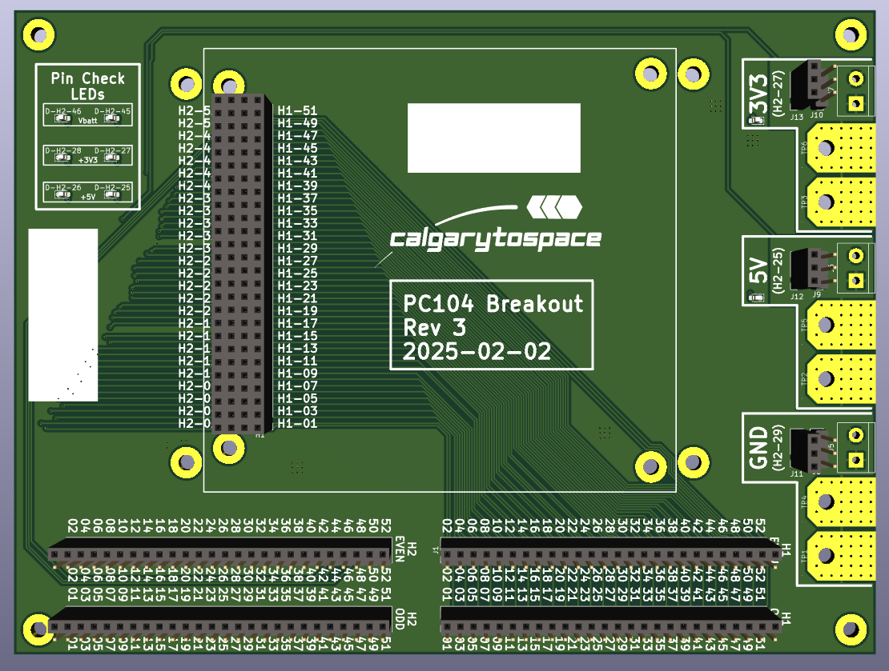
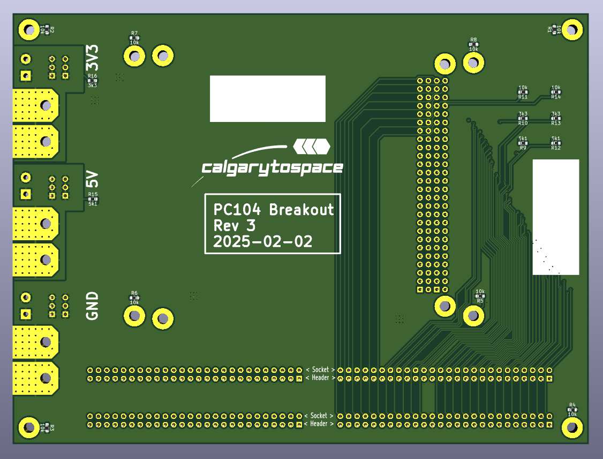

# PC104-Breakout-Board
A quick PCB to break out the PC104 connector for flatsat testing

## PCB

## Resources

* PC104 Dimensional Specification: https://dspace.cvut.cz/bitstream/handle/10467/94475/F3-BP-2021-Geib-Filip-bp_GEIB.pdf
    * Figure 2.2 (Page 11): Technical dimensional drawing
    * Appendix C (Page 65): PC104 Connector Pinout
        * Note: This is somewhat of a recommendation; every mission selects their own pinout.

## License

CERN Open Hardware Licence Version 2 - Permissive

Feel free to use as you see fit!
